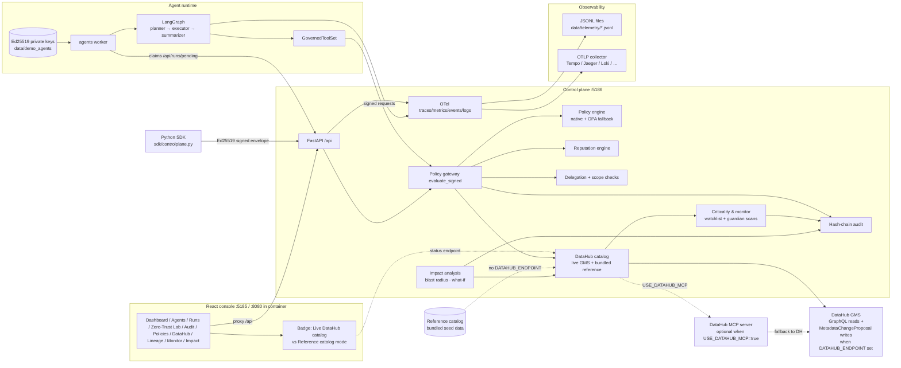
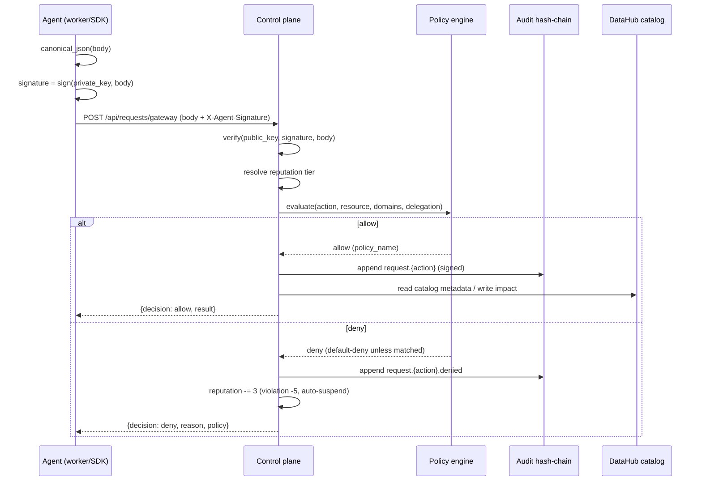
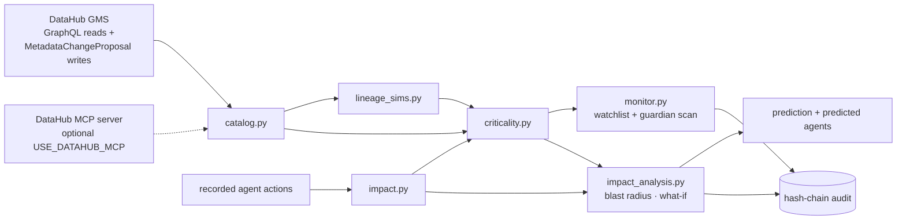
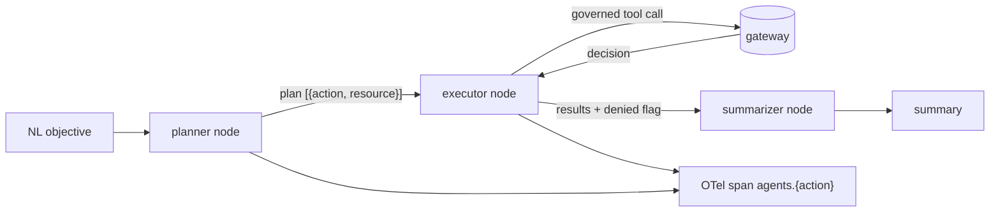
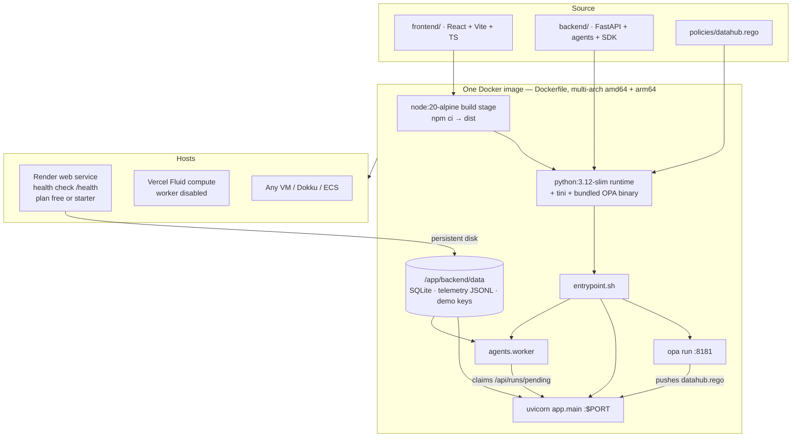

# Agent Control Plane — Architecture

Governed LangGraph agents, a signed zero-trust gateway, tamper-evident audit,
reputation, and DataHub context — with vendor-neutral MELT telemetry. Ships as
a single self-contained Docker image (console + API + bundled OPA + agent
worker) that runs anywhere: local, Render, Vercel, or a plain VM.

## System overview

## Trust model — zero trust, end to end

There is no shared secret and no implicit trust. Every request is an **Ed25519
signed envelope**:

Delegation extends the same model: a delegator signs a capability token scoped
to `{actions, datasets, domains}` with a depth limit and TTL. A delegated agent
inherits authority only inside that exact scope, and every hop in the chain is
itself audited.

## Components

| Component | File | Responsibility |
| --------- | ---- | -------------- |
| Gateway | `app/routers/requests.py` | Verify signature, run `evaluate_signed()`, return decision |
| Policy | `app/policy.py`, `app/opa.py` | Ordered default-deny rules; pushes Rego to OPA at startup, auto fallback |
| Reputation | `app/reputation.py` | Tiers, allow/deny/violation scoring, auto-suspend |
| Delegation | `app/delegation.py` | Scope validation, depth chain, capability tokens |
| Audit | `app/hashchain.py` | SHA-256 chain + Ed25519 signatures, `verify_chain` |
| DataHub | `app/datahub/` | Catalog + GraphQL client with optional MCP-server reads; agent impact contributed via MetadataChangeProposal ingest; `catalog.py` also seeds the bundled reference catalog when no DataHub is configured |
| Criticality | `app/datahub/criticality.py` | Dataset scores from PageRank centrality, agent impact, classification risk, blast radius |
| Monitor | `app/datahub/monitor.py` | Guardian scans, watchlist thresholds, breach events written to the audit chain |
| Impact | `app/datahub/impact_analysis.py` | Blast radius, what-if chaos experiments, predicted agents, risk prediction |
| Agents | `agents/` | LangGraph workflow, planner, tools, worker |
| SDK | `sdk/controlplane.py` | Real agents use this to sign & act |
| Telemetry | `app/telemetry.py` | MELT: metrics, events, logs, traces |
| Runtime | `scripts/docker/entrypoint.sh` | Starts bundled OPA + uvicorn + worker; picks engine by OPA presence |

## DataHub context: catalog, criticality & impact

Everything below derives from the catalog (domains, classifications, owners,
lineage DAGs) plus the control plane's own recorded agent actions — no external
scoring service. The catalog itself has two interchangeable sources:

- **Live DataHub** — when `DATAHUB_ENDPOINT` (+ optional `DATAHUB_TOKEN`) is
  set, rows are synced via GraphQL search/lineage.
- **Bundled reference catalog** — a curated seed (`seed_reference_catalog`,
  `app/datahub/catalog.py`) loaded at every boot when no DataHub is reachable.
  Stale sync rows are pruned (`_prune_stale_syncs`), so a demo never mixes
  generic synced noise with the curated stack.

`GET /api/datahub/status` → `catalog_source: "datahub" | "reference"` drives the
console's **Live DataHub catalog / Reference catalog mode** badge.

- **Criticality** — each dataset is scored as `0.35·centrality + 0.25·impact +
  0.20·risk + 0.20·blast`, where centrality is a lineage PageRank, impact is
  recorded agent activity weight, risk comes from classification, and blast is
  the size of the downstream subgraph. Watchlist entries add per-entity
  thresholds; crossings surface as alerts and, on demand, as audited
  `datahub.watchlist.breach` chain events.
- **Guardian scans** — the `ag_monitor` guardian runs the same governed
  workflow as any agent, producing a persisted `MonitorScan` (risk posture,
  criticality deltas, policy gaps, watchlist alerts, findings) that is audited.
- **What-if analysis** — each kind (outage, classification change, schema
  change, ownership transfer, data quality, new upstream, staleness, schema
  drift) walks the lineage graph with its own propagation semantics:
  consumers inherit the failure, schema-affecting kinds are evidence-based
  (only entities with recorded transform/write actions plus consuming jobs are
  marked affected). Results include a modeled risk/likelihood prediction and,
  when no agent has touched the subgraph, agents predicted to be impacted from
  delegations + domain grants.

## Optional external DataHub integrations

Two official DataHub tools can be enabled by config and are never required — the
control plane keeps working unchanged when they are off or unreachable:

- **DataHub MCP server** (`@acryldata/mcp-server-datahub`, PyPI
  `mcp-server-datahub`) — with `USE_DATAHUB_MCP=true`, catalog search and
  lineage reads go through the server's `search` / `get_lineage` tools instead
  of raw GraphQL. The server is spawned over stdio (`DATAHUB_MCP_COMMAND`,
  default `uvx mcp-server-datahub@latest`) or reached over an SSE endpoint
  (`DATAHUB_MCP_URL`). If the MCP server is unreachable, `app/datahub/client.py`
  transparently falls back to GraphQL, so a broken MCP process never breaks the
  catalog. Writes are unaffected: agent-impact contribution always uses DataHub's
  MetadataChangeProposal ingest API. Read provider is surfaced in
  `/api/datahub/status` → `providers.datahub_read`.
- **DataHub analytics agent** (`datahub-project/analytics-agent`, PyPI
  `datahub-analytics-agent`) — with `USE_ANALYTICS_AGENT=true`,
  `POST /api/datahub/analytics` answers a natural-language question by calling a
  running analytics-agent service (`ANALYTICS_AGENT_URL`, default
  `http://localhost:8100`) and returns the agent's text/SQL/chart. Otherwise the
  endpoint answers from the built-in catalog search. The analytics agent is a
  separate deployable service (FastAPI, LangGraph ReAct, SSE chat), so this
  control plane only ever talks to it over HTTP. Provider is surfaced in
  `/api/datahub/status` → `providers.analytics`.

## Governed LangGraph agents

* `workflow.py` — `StateGraph(AgentState)` with nodes `planner → executor →
  summarizer`, compiled with a `MemorySaver` checkpointer keyed by `thread_id`.
* `planner.py` — LiteLLM planner when `LLM_MODEL` is set; otherwise a
  role-aware rule-based planner (`query`/`transform`/`write` resolution with
  token-overlap entity matching against the catalog).
* `tools.py` — `GovernedToolSet` wraps the gateway: every `read/query/transform/
  write/ingest/deploy` call is a signed request that is governed, audited, and
  scored, whether the graph runs in-process or over HTTP from the worker.
* `runner.py` — `execute_run(agent_id, objective, mode)`:
  `inprocess` (sync runs/tests) or `http` (worker — keys live only in the
  agent runtime).
* `worker.py` — claims `pending` runs from `/api/runs/pending`, executes them,
  and posts outcomes back to `/api/runs/{id}/complete`.

## Telemetry — MELT, vendor-neutral

All four signal types are emitted through one configurable pipeline:

| Signal | What | Where |
| ------ | ---- | ----- |
| **M**etrics | `gateway.decisions`, `agents.runs`, `http.client.duration` | `metrics.jsonl` / OTLP `/v1/metrics` |
| **E**vents | every audit-chain event (`request.query`, `request.query.denied`, `agent.run.*`, …) mirrored with the `event.name` attribute | `logs.jsonl` / OTLP `/v1/logs` |
| **L**ogs | worker lifecycle, structured log records | `logs.jsonl` / OTLP `/v1/logs` |
| **T**races | `agents.plan`, `agents.execute`, `agents.{action}`, gateway/HTTP spans | `traces.jsonl` / OTLP `/v1/traces` |

Exporters are selectable with `CONTROLPLANE_TELEMETRY_EXPORTER`:
`file` (default, JSON Lines), `otlp` (any OTLP collector), `console`, or `none`.
No cloud-vendor SDK is used. See `backend/.env.example` and [SETUP.md](SETUP.md#telemetry).

## Deployment & runtime

The whole app ships as **one container** — the React console is built in a
first stage and served from the same FastAPI process (no separate frontend
server), the bundled OPA binary runs in-container on `127.0.0.1:8181`, and the
agent worker runs alongside the API. `scripts/docker/entrypoint.sh` starts all
three processes and defaults `SELF_URL` to the loopback so the worker polls the
container directly.

- **Ports:** container listens on `$PORT` (default `8080`; Render/Vercel inject
  their own). `EXPOSE 8080 8181`.
- **Worker:** `CONTROLPLANE_RUN_WORKER=true` (default in the image) runs the
  async run queue in-process; the Vercel variant ships it disabled
  (`Dockerfile.vercel`) so console runs fall back to `sync`.
- **Persistence:** mount `/app/backend/data` for durable SQLite + telemetry
  (Render `controlplane-data` disk, local volume, or compose volume). Without a
  mount, the DB reseeds the demo data + reference catalog on every boot.
- **Render image requires `linux/amd64`**; `scripts/render/deploy.sh` builds and
  pushes a multi-arch manifest (`linux/amd64,linux/arm64`) to Docker Hub first,
  then drives the Render API (`POST /services`, deploy trigger, status poll).

## Configuration

*Everything* is configured through `backend/app/config.py` (pydantic-settings)
read from the environment or `backend/.env`. There are no hard-coded
deployment values in application code; the defaults shown in the table below
are overridable by the matching env var.

| Setting | Env var | Default |
| ------- | ------- | ------- |
| Bind address | `HOST` / `PORT` | `0.0.0.0` / `5186` |
| Own URL | `SELF_URL` | `http://localhost:5186` |
| SDK base | `CONTROLPLANE_URL` | `http://localhost:5186` |
| Database | `DATABASE_URL` | `sqlite:///./data/controlplane.db` |
| Policy engine | `CONTROLPLANE_POLICY_ENGINE` / `POLICY_ENGINE` | `auto` |
| OPA endpoint | `CONTROLPLANE_OPA_URL` / `OPA_URL` | `http://localhost:8181` |
| OPA policy | `CONTROLPLANE_OPA_POLICY_NAME` / `CONTROLPLANE_OPA_POLICY_FILE` | `controlplane` / `policies/datahub.rego` |
| Run worker | `CONTROLPLANE_RUN_WORKER` | `false` locally; `true` in the container |
| DataHub | `DATAHUB_ENDPOINT` / `DATAHUB_TOKEN` | `` (offline catalog) |
| DataHub MCP reads | `USE_DATAHUB_MCP` / `DATAHUB_MCP_COMMAND` / `DATAHUB_MCP_URL` | `false` / `uvx mcp-server-datahub@latest` / `` |
| Analytics agent | `USE_ANALYTICS_AGENT` / `ANALYTICS_AGENT_URL` / `ANALYTICS_AGENT_ENGINE` | `false` / `http://localhost:8100` / `` |
| LLM planner | `LLM_MODEL` / `LLM_BASE_URL` / `LLM_API_KEY` / `LLM_TEMPERATURE` | `` (rule-based) |
| Worker poll | `WORKER_POLL_INTERVAL` / `WORKER_NAME` | `5.0` / `worker-default` |
| Telemetry | `CONTROLPLANE_TELEMETRY_*` + standard `OTEL_*` | `file` exporter |

## Demo / simulation scenarios

See [SETUP.md](SETUP.md#demo-scenarios) for runnable walkthroughs and the
console's **Zero-Trust Lab** for a self-driving scenario that exercises the
whole stack live.
