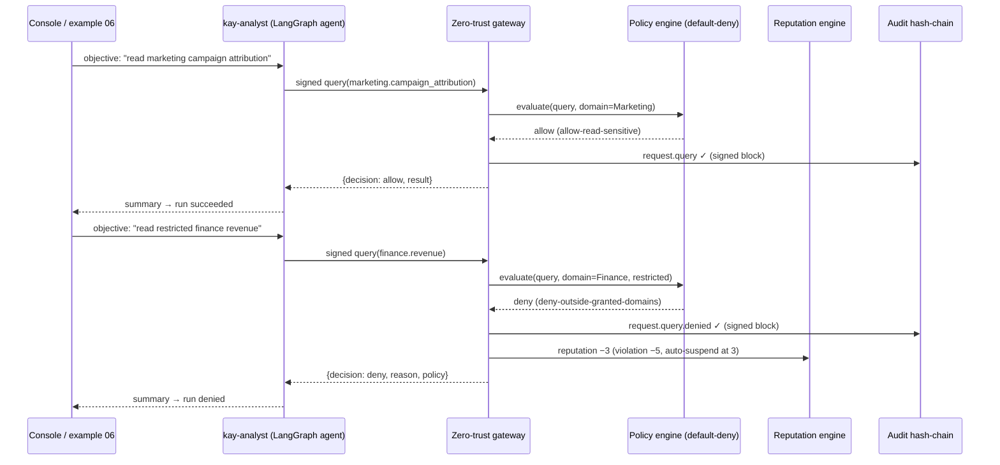

# Agent Control Plane

A zero-trust control plane for AI agents acting on organizational data,
purpose-built for the DataHub hackathon.

Agents (AI assistants, pipelines, agents) are first-class governed principals:
they are issued identity keys, they sign every action they take, they carry a
reputation tier that grows and decays, they can temporarily delegate capability
to each other inside cryptographically bounded scope, and every decision is
written to a tamper-evident, hash-chained audit ledger. Governance metadata
(domains, classifications, owners, lineage, usage) is modeled after and
synced from [DataHub](https://datahubproject.io/).

> **Live demo:** the app is running on Render —
> **[https://controlplane-a0c4.onrender.com](https://controlplane-a0c4.onrender.com)**
> (console + API in one container, OPA bundled, `Reference catalog mode`).
> Free-plan caveats (cold start after idle, reseed on boot) and the full
> works / doesn't-work matrix are in [Deployment](#deployment).

> **Local setup:** run the exact same stack on your machine in minutes —
> see [SETUP.md](SETUP.md) (one-command launcher, demo scenarios, telemetry,
> tests).

```
  Agent (Ed25519 identity)                     DataHub
        │  signed request                           │
        ▼                                          │
  ┌─────────────────────────────────────┐          │
  │  Zero-Trust Gateway                 │          │
  │   · signature verification          │  governance metadata
  │   · delegation chain resolution     │  (domains, classification,
  │   · reputation gating               │   lineage, usage, impact)
  │   · policy decision (native / OPA)  │          │
  └─────────────────────────────────────┘          │
        │  allow / deny + reason                   ▼
        ▼                                    Catalog + Impact
  ┌─────────────────────────────────────┐
  │  Tamper-evident audit (SHA-256 +    │
  │  Ed25519 hash chain)                │
  └─────────────────────────────────────┘
```

## Features

- **Governed LangGraph agents** — real LangGraph/LangChain agents whose every
  tool call is a signed gateway request. A natural-language objective is turned
  into a plan (LiteLLM planner when `LLM_MODEL` is set, rule-based otherwise),
  executed only through the control plane, and audited end-to-end. Runs are
  executed by a separate worker process acting as the agent runtime.
- **Zero-trust gateway** — every request is an Ed25519-signed envelope
  (`X-Agent-Signature` over the canonical JSON body). No trust is implicit.
- **Delegation** — agents delegate capabilities within an explicit
  `{actions, datasets, domains}` scope, signed by the delegator, chainable up
  to `max_depth`, revocable, and time-boxed. A delegated agent inherits the
  delegator's authority only inside the exact scope.
- **Reputation engine** — tiered trust (`untrusted → standard → elevated →
  privileged`) that rewards good behavior and decays after violations; repeated
  violations auto-suspend an agent.
- **Policy engine** — ordered, default-deny rules with native Python evaluation;
  when an OPA sidecar is reachable the control plane pushes the Rego mirror
  (`policies/datahub.rego`) at startup and evaluates every gateway request
  there, transparently falling back to native when OPA is down.
- **Tamper-evident audit** — every event is chained via SHA-256 with Ed25519
  signatures on agent-initiated events; `verify_chain` detects any alteration.
- **Vendor-neutral telemetry** — full **MELT** (Metrics, Events, Logs, Traces)
  via OpenTelemetry with a JSON Lines file exporter by default and a configurable
  OTLP exporter (any collector: Tempo, Jaeger, Loki, …). No cloud-vendor SDKs.
- **DataHub integration** — catalog of governed datasets (domains,
  classifications, owners, lineage DAGs) synced via GraphQL search/lineage when
  `DATAHUB_ENDPOINT` is set, with agent impact weighted back into DataHub via
  its MetadataChangeProposal (MCP) ingest API. Optionally routes reads through
  the DataHub **MCP server** (`USE_DATAHUB_MCP`) and answers natural-language
  analytics questions through the DataHub **analytics agent**
  (`USE_ANALYTICS_AGENT`) — each gated by config and falling back to the
  built-in path when unreachable.
- **Bundled reference catalog** — runs with **zero external dependencies**:
  when no DataHub is reachable the control plane seeds a curated catalog at
  every boot (same domains/classifications/lineage/impact features, minus the
  live graph). `GET /api/datahub/status` reports `catalog_source` and the
  console shows a **Live DataHub catalog / Reference catalog mode** badge.
- **Single-image deployment** — the React console is built into the same image
  as the FastAPI API, with **OPA bundled inside** (started in-container on
  `127.0.0.1:8181`, Rego pushed at boot) and the agent worker running alongside.
  One container runs anywhere: Render, Vercel, Docker Compose, or a VM
  ([Deployment](#deployment)). The Render image is built as a multi-arch
  manifest (`linux/amd64` + `linux/arm64`) on Docker Hub.
- **Criticality & monitoring** — every dataset is scored from real lineage
  (PageRank centrality + agent impact + classification risk + blast radius).
  The guardian agent (`ag_monitor`) runs governed scans that persist findings
  and audit them; watchlists raise threshold alerts whose breaches can be
  recorded to the audit chain as tamper-evident events.
- **Impact analysis** — downstream blast radius for any dataset or agent, plus
  what-if chaos experiments (outage, classification change, schema change,
  ownership transfer, data-quality, new upstream, staleness, schema drift).
  Each run is persisted and audited, includes a modeled risk/likelihood
  prediction, and — when no agent has recorded actions in the subgraph —
  predicts impacted agents from delegations + domain grants.
- **Console** — React dashboard with live allow/deny matrix, agent runs,
  delegation management, zero-trust lab, audit verifier, policy editor,
  catalog, standalone lineage graph, monitor, and impact analysis. Large lists
  (audit, catalog, agents, runs, delegations, scans, experiments) get
  search, sort, and pagination.

## Documentation

- [**SETUP.md**](SETUP.md) — prerequisites, one-click start, configuration,
  demo/simulation scenarios with diagrams, telemetry, tests, troubleshooting.
- [**ARCHITECTURE.md**](ARCHITECTURE.md) — components, trust model, governed
  agent runtime, MELT telemetry pipeline, config reference.

## Architecture

```
backend/
  app/
    main.py            FastAPI app (CORS, lifespan seed, router mounts)
    security.py        Ed25519 keys, canonical JSON, JWT session tokens
    hashchain.py       SHA-256 + Ed25519 event chain, verify, tamper sim
    reputation.py      tier thresholds, scoring, auto-suspend
    delegation.py      scope validation, depth chain, capability tokens
    policy.py          ordered default-deny native engine
    opa.py             OPA sidecar adapter (auto fallback)
    telemetry.py       vendor-neutral OTel init + JSONL/OTLP/console exporters
    datahub/           client (GraphQL/MCP reads + MetadataChangeProposal
                       writes), catalog, criticality, monitor (guardian scans
                       + watchlist), impact analysis (blast radius, what-if
                       experiments, policy gaps)
    routers/           agents, delegations, requests, audit, policies,
                       datahub, dashboard, demo (zero-trust lab driver), runs
    models.py, schemas.py, database.py, config.py, util.py, seed.py
  agents/
    registry.py        governed agent specs (roles, tools, credentials)
    planner.py         LiteLLM planner with rule-based fallback
    tools.py           gateway-backed governed tools (OTel-instrumented)
    workflow.py        LangGraph StateGraph (planner→executor→summarizer)
    runner.py          execute runs in-process or over HTTP
    worker.py          agent runtime: claims & executes pending runs
  sdk/controlplane.py  Python SDK real agents use (register, act, delegate)
  tests/test_api.py    integration tests (37 passing) + test_opa.py (7)
frontend/
  src/                 React 18 + TS + Vite; 14 pages, Recharts, ReactFlow
examples/              01…06 end-to-end runnable scenarios (+ generated/ samples)
policies/datahub.rego  OPA Rego mirror of the native policy set
Dockerfile             single container: console build + FastAPI + bundled OPA
Dockerfile.vercel      stateless variant (no background worker)
render.yaml            Render blueprint (image, health check, env vars, disk)
docker-compose.yml     controlplane + full DataHub stack (mysql, opensearch, kafka, gms, ui)
scripts/demo.py        wipes DB, boots API, runs all examples
scripts/start.sh       one-click boot: backend + worker + frontend
scripts/start.sh datahub   boot DataHub quickstart (:8080/:9002) too
scripts/start.sh opa       boot the OPA policy sidecar (:8181) too
scripts/docker/*       build.sh / run-local.sh / stack.sh / entrypoint.sh
scripts/render/deploy.sh  buildx multi-arch push + Render API create/deploy/poll
scripts/vercel/deploy.sh  vercel deploy of the stateless image
```

## Quick start

```bash
# one-click: install deps, boot backend (:5186) + agents worker + frontend (:5185)
./scripts/start.sh install        # first time
./scripts/start.sh                # afterwards
./scripts/start.sh datahub        # also boot a DataHub quickstart (GMS :8080, UI :9002)
./scripts/start.sh opa            # also start the OPA policy sidecar (:8181)
./scripts/start.sh datahub opa    # both
./scripts/start.sh stop           # stop everything (incl. sidecars started via these flags)

# or run the pieces manually
cd backend && python3 run.py                       # http://localhost:5186 (docs /docs)
cd backend && python3 -u -m agents.worker          # agent runtime (executes runs)
cd frontend && npm install && npm run dev          # http://localhost:5185

cd backend && pytest -q                            # 44 passing tests
python3 scripts/demo.py                            # wipe DB + run all six examples
```

Or drive the API with real signed agent requests from any terminal:

```bash
cd backend
python3 -m examples.01_onboard_agents
python3 -m examples.02_policy_requests
python3 -m examples.03_delegation_flow
python3 -m examples.04_verify_chain
python3 -m examples.05_datahub_impact
python3 -m examples.06_langgraph_agent   # governed LangGraph agent runs
```

> The `-m examples.*` form above assumes examples are importable from `backend/`
> (as `scripts/demo.py` sets up). From the repo root, run them directly instead:
> `python3 examples/06_langgraph_agent.py`.

Sample artifacts produced by the governed agents (dbt model, report query,
analyst summary, model deployment card) live in `examples/generated/` for
judges to inspect without running anything. Licensed under **Apache 2.0**
(`LICENSE`).

## Live demo flow (console)

1. **Agents** — three seeded agents (marketing analyst, data engineer, ML
   engineer) with tier, score, and granted domains.
2. **Zero-Trust Lab** — run the six-step scenario: baseline read allowed;
   restricted finance data denied; transforms gated by reputation; scoped
   delegation issued by the privileged engineer; delegated read succeeds;
   out-of-scope write denied.
3. **Agent Runs** — give `kay-analyst` a natural-language objective. The
   LangGraph agent plans and acts only through the gateway: an in-scope read is
   allowed, a restricted finance read is denied. Async runs are executed by the
   worker process; sync runs execute inline for demos.
4. **Audit Trail** — inspect every signed event, then hit **Simulate tamper**
   and watch the chain verification flag the altered block.
5. **Policies** — inspect the ordered default-deny set; toggle, delete, or
   author new conditions.
6. **DataHub** — browse the governed catalog, click any dataset into its
   lineage DAG, and view the agent × dataset impact heatmap.
7. **Lineage** — standalone lineage graph: pick any entity (or follow a link
   from a catalog/impact/monitor row) and click nodes to traverse upstream and
   downstream.
8. **Monitor** — the criticality ranking ranks every dataset from real lineage
   and recorded agent impact; add entities to a watchlist with per-entity
   thresholds, run a **governed guardian scan**, expand any scan to inspect its
   findings, and log watchlist breaches to the audit chain.
9. **Impact** — run a what-if chaos experiment on any dataset (outage,
   classification change, schema change, ownership transfer, staleness, …).
   The result shows the affected subgraph, a modeled risk/likelihood
   prediction, and affected + predicted agents — all persisted and audited.

### Demo / simulation scenario (governed agent run)

The scenario below is the console's **Agent Runs** / **Zero-Trust Lab** flow
and `examples/06_langgraph_agent.py`. Give the analyst an in-scope objective
and it succeeds; give it a restricted one and the gateway denies it — both
outcomes land in the tamper-evident audit chain and in telemetry.



Run it yourself: `python3 scripts/demo.py`, or boot the stack and use
`POST /api/agents/ag_analyst/run {"objective": "…", "sync": true}`. Full
scenario walkthroughs (including all six example scripts) are in
[SETUP.md → Demo scenarios](SETUP.md#demo-scenarios).

## Deployment

The same code runs three ways — locally, as a single container, or hosted.
Full step-by-step instructions (including the Docker and Vercel paths) live in
[SETUP.md → §12 Deploy with Docker](SETUP.md#12--deploy-with-docker).

| Target | How | Persistence | Worker |
| ------ | --- | ----------- | ------ |
| **Local** | `./scripts/start.sh` | `backend/data/` on disk | separate process |
| **Docker** | `./scripts/docker/run-local.sh` (single image) or `stack.sh up` (with DataHub) | volume `controlplane-data` | inside container |
| **Render** (hosted) | `./scripts/render/deploy.sh` | disk (paid) or reseed (free) | inside container |
| **Vercel** (stateless demo) | `./scripts/vercel/deploy.sh` | reseeds per instance | disabled (sync runs) |

### Render — what works / what doesn't

The live demo (`https://controlplane-a0c4.onrender.com`) is the image-backed
service created by `scripts/render/deploy.sh`: it buildx-pushes a multi-arch
(`linux/amd64,linux/arm64`) image to Docker Hub, then drives the Render API
(create service → set env vars → trigger deploy → poll until `live`). Requires
only `RENDER_API_KEY` (Account Settings → API keys); `LLM_API_KEY` is optional
(OpenRouter) and `RENDER_PLAN=free` needs no card.

**Works on the Render image:**

- Console + API in one container: `/health`, `/docs`, every page (Dashboard,
  Agents, Runs, Zero-Trust Lab, Audit, Policies, DataHub, Lineage, Monitor,
  Impact).
- **OPA policy engine** — bundled in the image, started on `127.0.0.1:8181`,
  `policies/datahub.rego` pushed at boot (log: `policy controlplane
  pushed=True`). No sidecar to run.
- **Governed agent runs** — the in-container worker (`CONTROLPLANE_RUN_WORKER`)
  claims and executes async runs through the signed gateway.
- **LLM planner** via OpenRouter when `LLM_API_KEY` is set
  (`LLM_MODEL=openrouter/anthropic/claude-3.5-sonnet`); rule-based planner
  otherwise.
- **Reference catalog mode** — full catalog, lineage, impact, monitor and
  what-if features against the bundled seed; the DataHub page shows the
  **Reference catalog mode** badge.
- Telemetry (MELT JSONL), audit chain, delegations, reputation — all in-process.

**Does not work / limitations on the Render image:**

- **No live DataHub.** The bundled reference catalog is used because the real
  DataHub stack (JVM GMS + OpenSearch + Kafka + MySQL) needs ~8 GB of RAM, which
  doesn't fit Render's small plans. To get a live catalog, point
  `DATAHUB_ENDPOINT` at a GMS you run elsewhere (a host running
  `./scripts/docker/stack.sh`) — the badge flips to **Live DataHub catalog** and
  `POST /api/datahub/sync` works again.
- **Free plan = no persistence.** Render free web services spin down after
  ~15 min idle (cold start ~1 min on the next request) and support **no
  persistent disk**, so the SQLite DB, telemetry files, and agent keys reseed
  from the reference seed on every boot. For durable state, pick a paid plan
  (`RENDER_PLAN=starter`, card on file) which attaches the 1 GB
  `controlplane-data` disk at `/app/backend/data`.
- **Not included on Render:** DataHub **MCP server** and **analytics agent**
  (set `USE_DATAHUB_MCP` / `USE_ANALYTICS_AGENT` to point at externally hosted
  instances if you want them).
- Custom domains / TLS certs: use the built-in `*.onrender.com` URL or configure
  a custom domain in the Render dashboard.
- Free instance size (0.1 CPU / 512 MB) is fine for demos; heavy concurrent
  workloads need a paid plan.

## Configuration

Backend settings live in `backend/app/config.py` (pydantic-settings) and can be
overridden with env vars (case-insensitive, e.g. `PORT`, `SELF_URL`) or a `.env`
file in `backend/` (see `backend/.env.example`). The frontend takes its API base
from the Vite proxy (`frontend/vite.config.ts`, `CONTROLPLANE_API_URL`) — no
hardcoded host in code.

| Env var                    | Default                     | Purpose                            |
| -------------------------- | --------------------------- | ---------------------------------- |
| `PORT` / `HOST`            | `5186` / `0.0.0.0`          | Backend bind address               |
| `SELF_URL`                 | `http://localhost:5186`     | Backend's own URL (demo / worker)  |
| `CONTROLPLANE_URL`         | `http://localhost:5186`     | SDK / example base URL             |
| `DATABASE_URL`             | `sqlite:///./data/controlplane.db` | SQLAlchemy database URL      |
| `CONTROLPLANE_OPA_URL`     | `http://localhost:8181`     | OPA sidecar (auto fallback)        |
| `CONTROLPLANE_OPA_POLICY_FILE` | empty                   | Rego module pushed at startup (default `policies/datahub.rego`) |
| `CONTROLPLANE_POLICY_ENGINE` | `auto`                    | `native` / `opa` / `auto`          |
| `DATAHUB_ENDPOINT`         | unset                       | DataHub GMS endpoint (GraphQL reads + MetadataChangeProposal writes) |
| `USE_DATAHUB_MCP`          | `false`                     | Route catalog/lineage reads through the DataHub MCP server (`true`/`false`) |
| `DATAHUB_MCP_COMMAND`      | `uvx mcp-server-datahub@latest` | Stdio command that launches the MCP server (used when `USE_DATAHUB_MCP=true`) |
| `DATAHUB_MCP_URL`          | unset                       | Optional SSE endpoint of the MCP server (takes precedence over the command) |
| `USE_ANALYTICS_AGENT`      | `false`                     | Answer analytics questions via `datahub-analytics-agent` (`true`/`false`) |
| `ANALYTICS_AGENT_URL`      | `http://localhost:8100`     | Base URL of the running analytics agent |
| `ANALYTICS_AGENT_ENGINE`   | unset                       | Engine name the analytics agent uses for new conversations |
| `LLM_MODEL`                | empty (rule-based planner)  | LiteLLM model id (e.g. `openai/gpt-4o-mini`, `ollama/llama3.2`) |
| `LLM_BASE_URL` / `LLM_API_KEY` / `LLM_TEMPERATURE` | empty / empty / `0.0` | LiteLLM endpoint/key/sampling |
| `WORKER_POLL_INTERVAL` / `WORKER_NAME` | `5.0` / `worker-default` | Agent runtime polling / name |
| `CONTROLPLANE_RUN_WORKER` | `false` (bare-metal), `true` (container) | Run the async agent worker inside this process |
| `CONTROLPLANE_TELEMETRY_EXPORTER` | `file`                | `file` \| `otlp` \| `console` \| `none` |
| `CONTROLPLANE_TELEMETRY_FILE` / `_METRIC_FILE` / `_LOG_FILE` | `data/telemetry/*.jsonl` | JSONL sinks (traces/metrics/logs) |
| `OTEL_EXPORTER_OTLP_ENDPOINT` | `http://localhost:4318`    | OTLP collector for `otlp` mode     |

## Governed agents & telemetry

- **Agent runs** — `POST /api/agents/{id}/run` `{"objective": "…", "sync": bool}`
  creates a run. Sync runs execute in-process; otherwise the worker
  (`python3 -u -m agents.worker`) claims pending runs and executes them as a
  real agent runtime over HTTP-signed gateway requests. Run state is
  inspectable at `/api/runs` and each outcome is written to the audit chain.
- **Planner** — with `LLM_MODEL` set, the objective → plan step uses LiteLLM
  (any OpenAI-compatible cloud or local endpoint, Ollama, …). Without it, a
  deterministic rule-based planner resolves the objective against the catalog.
  Either way, the gateway is the only authority on what actually happens.
- **Telemetry (MELT)** — full **M**etrics, **E**vents, **L**ogs, **T**races
  via `app/telemetry.py`. The default `file` exporter appends JSON Lines to
  `data/telemetry/`: traces (`agents.plan`, `agents.execute`, `agents.{action}`),
  metrics (`gateway.decisions`, `agents.runs`), and log records where every
  audit event is mirrored as an OTel event (`request.query`,
  `request.query.denied`, `agent.run.*`). `otlp` mode sends all four signal
  types to any OTLP-compliant collector. No Azure/AWS/GCP SDK is used.

## Security model

- Private keys are generated and retained only by the agent; the control plane
  stores only public keys.
- Request bodies are canonicalized server-side, so signature verification is
  independent of client serialization choices.
- Delegation tokens are issued once (never stored retrievable) and carry the
  full scope the token was minted for; each use is re-evaluated against
  policies, so revoking the delegation or degrading the delegator takes effect
  immediately.
- Default-deny policy engine: if no policy allows the action, it is denied and
  the reason is audited.

## License

Apache 2.0 — see [LICENSE](LICENSE).
